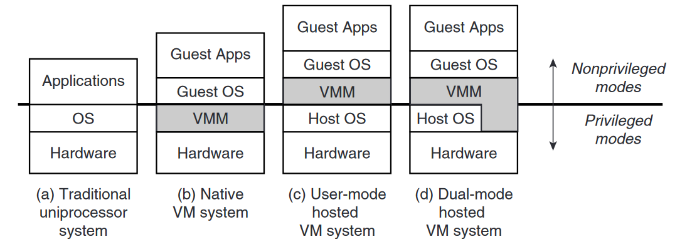

# Создание виртуальных машин на аппаратном уровне: актуальность и применение

## Введение

Виртуализация, и в частности технология создания виртуальных машин, в настоящее время
становится особенно популярной для серверов и иных приложений в сети, но кроме этого
она находит также применения в контексте операционных систем, разработки компиляторов
и проектировании архитектуры процессоров.
Технология виртуальных машин позволяет обеспечивать высокий уровень изоляции и абстракции, позволяет достигать
максимальной платформонезависимости,
реализует динамическую трансляцию и оптимизацию для языков программирования.

## Основы технологии виртуальных машин

Прежде, чем говорить о непосредственной виртуализации, необходимо уточнить, что
есть на самом деле машина в данном контексте. Можно воспринимать понятие машины
с двух сторон: со стороны **процесса**, и со стороны **системы**.

С точки зрения процесса в современных операционных системах, уровни абстракции способствуют
тому, что внутреннее устройство физической машины прозрачно - система взаимодействует с
логическим адресным пространством, с инструкциями в соответствие с ISA, пользовательскими
регистрами; взаимодействие с внешними устройствами только через операционную систему.
Интерфейс взаимодействие машины определяется ABI:

С другой стороны, точки зрения системы в целом возможно сдвинуть границу в
сторону Host системы.
В таком случае, всё, что касается hardware уже не является прозрачным,
и гостевая операционная система должна использовать интерфейсы
виртуальной машины:

## Программная виртуализация

Виртуальные машины, где в качестве Guest используется процесс (для
удобства будем называть далее это программно виртуализацией или виртуализацией приложений).

Особенности:

* Создание иллюзии пользовательскому процессу о его единственности в системе
  (к данному пункту относятся технологии обеспечения изоляции процессов
  в современных операционных системах, подобный механизм также применяется и для виртуальной памяти)
* Эмуляция (как было указано во введении, существует возможность эмулировать
  различные аппаратные особенности (платформонезависимость, ISA)
  с помощью хостовой операционной системы)
* Отсутствие необходимости согласованности ISA для гостевых приложений
  (фактически все вызовы процесса идентичны системным вызовам к хостовой операционной системе)
* Динамическая бинарная трансляция (используется для конвертации инструкций из guest в host)
* Возможность оптимизации в случае, если ISA Host и Guest совпадают

Недостатки:

* Низкая производительность (для задач, в которых возможно применение
  аппаратной виртуализации использование программной будет существенно
  менее производительным по причине лишнего уровня в виде хостовой операционной системы и излишней эмуляции)
* Сложность преобразования Guest ISA в Host ISA (поведение гостевого процесса с его инструкциями
  должно быть идентично поведению на хосте с другим набором инструкций)

Гостевые процессы, взаимодействующие с хостовой операционной системой: \

Примером подобной технологии является VMware ThinApp - она способна выполнять любое приложение
без установки в традиционном понимании с помощью виртуализации (эмуляции) ресурсов. Все ресурсы
сохраняются в локальном каталоге программы, когда приложение запрашивает какой-либо ресурс,
слой виртуализации ThinApp перехватывает запрос и возвращает запрашиваемое значение из
файла локального каталога, и устанавливаемое приложение не выполняет напрямую обращений к hardware,
с которым он физически должен взаимодействовать.

Существенным фактором для разработки подобного рода технологий виртуализации является необходимость
явного преобразования систем команд: например для запуска архитектуры ARM на физическом
процессоре x86, разработчику необходимо явно указать механизмы эмуляции - преобразования системы команд.
Вся цепочка "Fetch -> Decode -> Execute" для инструкции выполняется на уровне программного обеспечения.
Тут же возникает существенная проблема в несоответствии архитектур: как преобразовать CISC в RISC, допустим?
Подобные проблемы порождают особые принципы преобразования машинного кода: например, можно
встретить программную виртуализацию, в основе которой лежит принцип простой трансляции, так и, например,
использование [threaded code](https://en.wikipedia.org/wiki/Threaded_code). Здесь также возникает проблема
применимости определенных методов в зависимости от архитектуры (ох уж этот CISC...), но эта тема
выходит за рамки данной статьи.

Кроме того, как логическое дополнение к программной виртуализации
также выступают и High-Level Language Virtual Machines. Основное отличие или, скорее,
особенность данного класса виртуальных машин - гостевая ISA спроектирована
таким образом, чтобы она отражает важные особенности конкретного языка высокого уровня.
Java Virtual Machine относится именно к этому классу виртуальных машин и также реализует
механизм программной виртуализации. Например, если преобразовать CISC под другую архитектуру достаточно
проблемно, то в случае с HLVM, байт-код (или что-то подобное) уже спроектирован таким образом, чтобы
процесс трансляции был максимально безболезненным и недоростоящим с точки зрения используемых ресурсов.

## Аппаратная виртуализация

После того, как мы поверхностно познакомились с программной виртуализацией, можем перейти
к основной теме статьи - аппаратная виртуализация, или то, как компьютер может с минимальными
ресурсными потерями обеспечивать несколько гостевых систем.
В случае с аппаратной виртуализацией (или, как было сказано ранее, виртуализация со стороны системы),
не будем ограничиваться лишь коротким описанием особенностей и недостатков, а отметим
все основные концепции, ограничения, которые лежат внутри данного механизма.

В случае с программной виртуализацией создаётся виртуальную среда для отдельного процесса
и создаётся для него иллюзия, что он существует в системе единолично с помощью механизма
разделения времени. Обобщая данный механизм, можно прийти к концепции аппаратной виртуализации -
подобная иллюзия создаётся не только для одного процесса, а для всей системы в целом.
Здесь реальные ресурсы хостовой системы разделяются между гостевыми операционными системами, это
приводит нас к ограничению на подобную систему - необходимо распределять системные ресурсы (процессорное время, память)
не только между процессами операционной системы, но и между виртуальными машинами, каждая из
которых, в своию очередь, имеет собственную операционную систему.

В случае с аппаратной виртуализацией возникает существенно больше трудностей - те системные ресурсы,
за которые в случае с программной виртуализацией была ответственна хостовая операционная система,
теперь должны управляться с помощью механизмов внутри Virtual Machine Monitor.
В особых случаях, когда запрашивается ресурс, который физически не существует,
гипервизор (монитор) может эмулировать его присутствие с помощью, допустим, иных механизмов, которые
существует физически на стороне хоста.

## Реализация аппаратной виртуализации

Существует несколько видов систем с аппаратной виртуализацией: некоторые из них включат также хостовые
операционные системы и обладают различными привелегиями:

Фактически во всех случаях ключевой компонент системы - VMM (гипервизор) - программное обеспечение, которое
в основном занимается управлением системными ресурсами hardware и частично делегирует эту задачу Host OS.
Ключевое отличие Hosted виртуальных машин (где присутствует Host OS), в том, что для удобства взаимодействия с
аппаратным
уровнем и упрощением VMM, добавляется уровень хостовой операционной системы, которая
может, как являться прослойкой между VMM и аппаратным уровнем, так и дополнительным
уровнем абстракции - данная концепция предназначена, как правило, для общего упрощения
системы и использования механизмов операционной системы в качестве управления аппаратным уровнем.
Хостовая операционная система может использоваться как упрощения работы с устройствами ввода-вывода
(QEMU, VirtualBox, VMWare Workstation), так и для полноценного доступа к физическому оборудованияю
(тонкий гипервизор: Microsoft Hyper-V, OVirt, Xen).

Вернёмся теперь к основному вопросу в реализации аппаратной виртуализации - управлению ресурсами.
Подобно операционной системе, VMM необходимо распределить процессорное время, память, осуществить
доступ к внешним устройствам для гостевой операционной системы.
В основном используется принцип разделения времени, подобный тому, что есть в операционных системах:

Важная особенность, которую нельзя забывать - процессор один (в упрощенном случае), и перед ним
стоит задача исполнения всех инструкций - как пользовательские, поступившие от
гостевой операционной системы, так и от VMM, Host OS. Это может быть достигнуто, как эмуляцией
(подобно описанным ранее принципам с программной виртуализацией), так и с помощью
прямого исполнения инструкций процессором. Управляет этим процессом непосредственно VMM, но здесь
также стоит помнить о том, как связаны все ISA - если они различны, подойдёт
либо эмуляция, либо разделение hardware по принципу архитектуры системы команд.

## Применение аппаратной виртуализации

Здесь отразим основные способы применения механизма аппаратной виртуализации: как исторические, так и актуальные

* Инкапсуляция системы
* Многопользовательские системы \
  К примеру, на мейнфреймах была возможность поддерживать для каждого пользователя свою собственную
  легковесную операционную систему, которая управлялась отдельным монитором
* Безопасное окружение \
  В случае создания новой гостевой системы, ошибки, которые могут произойти в _программной_
  части данной гостевой системы, не повлияют на гостевую систему (песочница)
* Одновременный запуск нескольких операционных систем \
  В случае использования аппаратной виртуализации накладки по производительности будут не такими
  существенными, как в случае с эмуляцией данных операционных систем
* Инструментарий операционной системы \
  В случае с использованием механизма аппаратной виртуализации мы можем получить достаточно информации
  о событиях, которые происходят в системе, а также об их природе, так как Virtual Machine Monitor
  имеет доступ к hardware, что делает доступным сбор большинства информации о событиях в системе.
  Исключение составляют некоторые счётчики в системе (например, сбор информации о кеше будет общим
  для всех виртуальных машин в случае, если физически аппаратно не предусмотрено иное, например, в случае
  физического разделения hardware)
* Системный мониторинг \
  В зависимости от конкретной реализации Virtual Machine Monitor может предоставлять возможности,
  которые могут быть недоступны на изначальной системе - dump, trace, состояние машины. В таком случае
  механизм аппаратной виртуализации может дополнять существующую систему.

## Заключение

Основная популярность аппаратной виртуализации пришлась на 70-80-90 года
прошлого века в связи с тем, что необходимо было разработать механизм использования
ресурсов компьютера максимально эффективно - и на помощь с этим пришла аппаратная виртуализация.
В дальнейшем, как операционные системы эволюционировали, данная потребность практически
отпала в связи с тем, что показатели производительности были существенно лучше у операционных систем.
Сейчас постепенно набирает популярность технология аппаратной виртуализации, но уже по другим
причинам. Основная тенденция - инкапсуляция всей системы и обеспечение безопасного окружения, и потребность
в данных технологиях, вполне вероятно, приведут к дальнейшему развитию механизмов аппаратной виртуализации.
