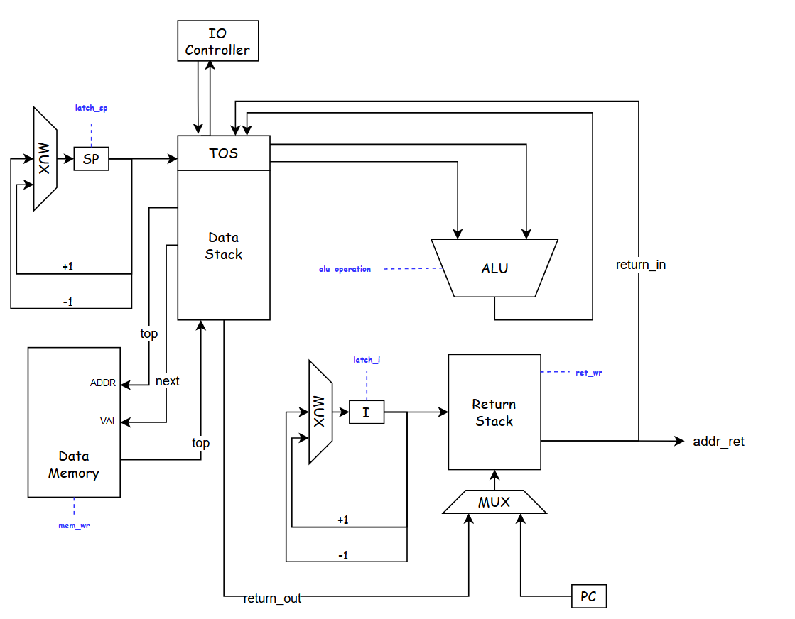
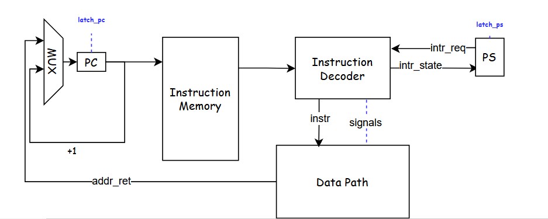

# Лабораторная работа №3. Транслятор и модель процессора

* P33121. Зинатулин Артём Витальевич
* ```forth | stack | harv | hw | tick | struct | trap | port | pstr | prob5 | spi```
* без усложнения

## Язык программирования

```ebnf

<процедура> →   ": " <название процедуры> <программа> " ;"

<программа> →   <пусто> | <слово> | <программа> " " <программа> | <условный оператор> |
                <оператор цикла do loop> | <оператор цикла begin until> <объявление переменной>
                
<объявление переменной> → "variable " <переменная> ["allot " <целочисленный литерал>] 

<условный оператор> → if <программа> [else <программаа>] then  

<оператор цикла do loop> → do <программа> loop  

<оператор цикла begin until> → begin <программа> until  

<слово> →   <целочисленный литерал> | <математический оператор> | <отображение строки> | <название процедуры> |
            "mod" | "drop" | "swap" | "over" | "dup" | "read" | "omit" | <переменная> | "@" | "!" | "ei" | "di"

<математический оператор> → "+" | "-" | "*" | "/" | "=" | "<" | ">" 

<отображение строки> → "." <строковый литерал>

```

Код выполняется последовательно за исключением процедур.
Вызов процедуры осуществляется при указании в программе её названия. Комментарии не предусмотены.

Ниже описаны основные стековые операции в виде (stack_before -- stack_after) с некоторыми пояснениями.

* ```+``` - (n1 n2 -- n3)
* ```-``` - (n1 n2 -- n3)
* ```*``` - (n1 n2 -- n3)
* ```/``` - (n1 n2 -- n3)
* ```=``` - (n1 n2 -- n3) n3 = 1 if n1 == n2 n3 = 0 if n1 != n2
* ```>``` - (n1 n2 -- n3) n3 = 1 if n1 > n2 n3 = 0 if n1 <= n2
* ```<``` - (n1 n2 -- n3) n3 = 1 if n1 < n2 n3 = 0 if n1 >= n2
* ```mod``` - (n1 n2 -- n3)
* ```drop``` - (n1 -- )
* ```swap``` - (n1 n2 -- n2 n1)
* ```over``` - (n1 n2 -- n1 n2 n1)
* ```dup``` - (n1 -- n1 n1) -
* ```key``` - (n1 -- n2) - ввод c порта n1
* ```omit``` - (n1 n2 -- ) - вывести ASCII символ с кодом n1 в IO порт n2
* ```read``` - (n1 -- n2) - прочитать значение с порта n1 и положить на стек
* ```!``` - (n1 n2 -- ) - записать значение n1 в ячейку памяти n2
* ```@``` - (n1 -- n2) - прочитать значение из ячейки памяти n1 и положить его на стек
* ```ei``` - ( -- ) - включить прерывания
* ```di``` - ( -- ) - отключить прерывания

Условный оператор ```if``` выполняется в зависимости от истинности значения на вершине стека.
Истинным значением является любое целое числа за исключением 0. Ложным значением является 0.

Оператор цикла ```do loop``` выполняет ```K``` итераций в зависимости от двух значений на вершине стека (n1 n2);
```K = n1 - n2```. Внутри конструкции ```do loop``` возможно использовать
переменную ```i```, ```i = n2 + <номер итерации>```.
Аналогично конструкции ```for (i = n2; i < n1; i++) {}``` в алгоритмическом языке программирования

Оператор цикла ```begin until``` выполняет итерации до момента, когда на вершине стека
по достижению конструкции until не будет лежать истинное значение (отличное от нуля).

Оператор объявления переменной ```variable``` создаёт переменную и сопоставляет ей
определенную ячейку памяти, взаимодействовать с которой возможно при помощи ```!``` и ```@```.
В случае добавления ключевого слова ```allot``` выделяется непрерывный участок памяти с фиксированным
в программе размером.

Комментарием в языке является строка вида ```\[^\n]```: любые символы в строке после \ трактуются как комментарии.

Используемые литералы:

* строковые литералы - имеют вид " <строка>", используются для экранизации текста после оператора ```.```
* целочисленные литералы - являются полноценным словом в программе и необходимы для того, чтобы положить конкретное
  значение на вершину стека, диапазон значений - $[-2^{31}, 2^{31} - 1]$


## Организация памяти

* Память данных и команд раздельна
* Размер машинного слова данных -- 32 бита
* Размер машинного слова команд -- 40 бит, первые 8 бит -- тип команды
* Программисту в явном виде доступен исключительно стек данных и память, зарезервированная
  под переменные
* Память данных и команд выделяется статически при запуске модели
* Доступен один вид прерываний - его обработчик лежит по адресу 01 в памяти команд
* Процедуры хранятся в памяти последовательно и вызов может быть выполнен из любой
  части программы. Подробнее - см. трансляция.
* Машинная команда может использоваться как с аргументами (адрес/значение), так и без них.
* Ввиду специфики варианта, числовые и строковые литералы записываются в память данных в 
  момент исполнения программы, а не при запуске модели с помощью команд с Immediate Value.
* Все переменные хранятся статически в памяти данных
* Используется стек данных и стек возврата, они являются отдельным физическим устройством
  по отношению к памяти данных и команд (см. модель процессора)

Память команд

```text

+-----------------------------+
| 00       jmp N              |
| 01       interrupt handle   |
|      ...                    |
| N - 1    interrupt handle   |
+-----------------------------+
| N        program            |
| N + 1    program            |
|      ...                    |
| 4095     program            |
+-----------------------------+
```

Память данных

```text
+-----------------------------+
| 00       string literals    |  |
| 01       string literals    |  |
|      ...                    |  v
| 511      strings literal    |  
+-----------------------------+
| 512      variables          |  |
| 513      variables          |  |
|      ...                    |  v
| 1095     variables          |  
+-----------------------------+

```

Команда в памяти команд (в реализации лабораторной хранится в виде высокоуровневой структуры,
но будь бы на ее месте бинарная структура -- она бы выглядела именно так):

```text
+-----------------------------------------------------------+
| Код команды (0:7) | Адрес / Immediate Value (8:39)        |
+-----------------------------------------------------------+
```

## Система команд

### Цикл исполнения команды
1. Выборка инструкции (осуществляется в один такт с исполнением инструкции без сохранения информации в промежуточные
регистры)
2. Проверка на прерывание (если прерывание, сохранение PC в Return Stack, переход к обработчику прерывания)
3. Исполнение команды (количество тактов необходимых для исполнения указано в таблице ниже)

### Набор инструкций

Большинство инструкций языка в явном виде соответствуют машинным командам, в таблице ниже
приведены все элементы системы команд ([isa.py](isa.py)). Те машинные команды, которые без комментария --
соответствуют слову из языка программирования.

| Инструкция  | Кол-во тактов | Комментарий                                                            |
|:------------|:--------------|:-----------------------------------------------------------------------|
| mul         | 2             |                                                                        |
| div         | 2             |                                                                        |
| sub         | 2             |                                                                        |
| add         | 2             |                                                                        |
| mod         | 2             |                                                                        |
| eq          | 2             |                                                                        |
| gr          | 2             |                                                                        |
| ls          | 2             |                                                                        |
| drop        | 2             |                                                                        |
| swap        | 3             |                                                                        |
| over        | 4             |                                                                        |
| dup         | 2             |                                                                        |
| ei          | 1             | разрешить прерывания                                                   |
| di          | 1             | запретить прерывания                                                   |
| omit        | 4             |                                                                        |
| read        | 2             |                                                                        |
| store       | 4             | память данных из стека                                                 |
| load        | 2             | в стек из памяти данных                                                |
| push <imm>  | 3             | записать в стек непосредственное значение                              |
| pop         | 4             | перенести значение со стека данных в стек возврата                     |
| rpop        | 1             | перенести значение из стека возврата в стек данных                     |
| jmp <addr>  | 1             | перейти по адресу                                                      |
| zjmp <addr> | 1             | перейти по адресу, если на вершине стека 0 (убирает значение со стека) |
| call <addr> | 1             | вызов процедуры                                                        |
| ret         | 1             | выход из процедуры или прерывания                                      |
| halt        |               | завершение программы                                                   |

Количество тактов обусловлено спецификой устройства процессора, подробнее -- в разделе "Модель процессора".

### Кодирование инструкций

Инструкции кодируются в формат JSON и имеют вид:

```json
 {"index": 165, "command": "push", "arg": 554}
```

В данной конструкции аргумент опционален и может быть упущен в зависимости от типа команды.

## Транслятор

Интерфейс командной строки `translator.py <input_file> <target_file>`

Реализован в модуле [translator.py](translator.py).

Основные сущностные элементы используемые в процессе трансляции: 
* слово -- исходное слово в тексте программы (разделены пробелами)
* терм (Term ([translator.py:Term](translator.py#L9))) -- слово программы, преобразованное в формат машинной команды (слово != терм только для литералов)
* машинное слово (Opcode ([isa.py:Opcode](isa.py#L57))) -- непосредственно машинная команда

Трансляция происходит в несколько этапов ([translator.py:350](translator.py#L350)):
1. Разбиение исходного текста программы в набор термов (1 слово = 1 терм)
2. Валидация полученных термов (циклы, процедуры, условные операторы)
3. Трансляция термов в машинные команды (1 терм = N команд)
4. Линковка

### Разбиение текста программы в набор термов

Так как текст программмы представляет собой набор слов, разделенных пробелами
или переносом строки, процесс перевода слов в набор термов тривиален.

Реализуется функцией [translator.py:split_to_terms](translator.py#L61).

### Валидация полученных термов

Корректная программа на языке Forth должна удовлетворять формальным условиям, описанных в разделе "Язык программирования".
Менее формально:
* терму `DO` должен соответствовать последующий терм `LOOP`
* терму `BEGIN` должен соответствовать последующий терм `UNTIL`
* терму `IF` должен соответствовать последующий терм `THEN`, между ними может располагаться терм `ELSE`
* терму `:` должен соответствовать последующий терм `;`
* терму `:intr` должен соответствовать последующий терм `;`
* объявление переменной должно иметь вид `variable <name> [allot <int>]`

Таким образом, на данном этапе проводится валидация термов, их дополнение необходимой мета-информацией
и оповещение пользователя в случае неуспешной трансляции с указанием ошибки и номера слова с ошибкой.

Реализуется функцией [translator.py:validate_and_fix_terms](translator.py#L173).

### Трансляция термов в машинные команды

Одному терму может соответствовать несколько Opcode, следовательно необходимо корректным образом
с эффективностью по времени преобразовать термы в последовательность машинных команд.
В терминах языка Python было принято решение следующих трансформаций:
```text
  list[Term] -> list[list[Opcode]] -> list[Opcode]
```

Первые два списка имеют одинаковую длину, во втором преобразовании происходит "распрямление"
полученного списка списков машинных команд.

Правила трансляции Term в Opcode с комментарием преобразований на стеке в некоторых случаях
определены в функции [translator.py:term_to_opcodes](translator.py#L224).

### Линковка

На этапе валидации каждому терму `IF`, `DO`, `:`, `ELSE` ставится в соответствие дополняющий его терм.
Подобная процедура выполняется также для `variable`, `allot`.

Таким образом, получается список операций, некоторые из которых могут ссылаться на другие.

Для преобразования этой структуры в последовательный список термов необходимо провести их
линковку, т.е. заменить адреса на термы адресами на машинные команды. Для этого используются различные
варианты адресации внутри машинных команд (абсолютная -- на конкретный терм и относительная -- по отношению к текущему).
Реализуется функцией [translator.py:fix_addresses_in_opcodes](translator.py#L293).

Стоит заострить внимание на процессе трансляции строковых литералов.
Так как целочисленые литералы преобразуются в машинную команду `PUSH <int>`, было 
решено применить ради простоты модели процессора подобный механизм и для строк.
Строковые литералы в языке Forth используются сразу для вывода их на внешние устройства,
следовательно строковый литерал вида `." string"` будет развернут в последовательность команд, 
последовательно выполняющие следующие действия:

* запись в память данных азмера строки (prefix-strings)
* посимвольня запись содержимого строки в память данных
* цикл, который осуществляет вывод строки

Данная последовательность команд может быть сокращена просто до вывода строки на внешнее
устройство, но имеет такой вид ввиду формальных критерием к лабораторной работе относительно
хранения строк в памяти.

## Модель процессора

Интерфейс командной строки: `machine.py <machine_code_file> <input_file>`

Реализовано в модуле: [machine.py](machine.py).

Stack Controller:


DataPath:


ControlUnit:


[//]: # (todo: link to class)
DataPath реализован в классе [machine.py:DataPath](machine.py#L132412341234123). 

ControlUnit реализован в классе [machine.py:ControlUnit](machine.py#L132412341234123). . 

Stack Controller является частью DataPath и предназначен для упрощения схемы, в коде включен в класс [machine.py:DataPath](machine.py#L132412341234123).

Память:

* `Data Memory` -- однопортовая память данных
* `Instruction Memory` -- однопортовая память команд (Read Only)
* `Data Stack` -- стек для хранения данных программы (доступен программисту)
* `Return Stack` -- стек для хранения адресов возврата и переменной цикла

В модели процессора предусмотрены следующие регистры (недоступны для программиста):

* `SP` -- адрес верхушки стека данных минус два верхних элемента
* `I` -- адрес верхушки стека возврата
* `PC` -- адрес указывающий на текущую исполняемую команду
* `PS` -- состояние программы, 2 бита: разрешены ли прерывания и есть ли запрос на прерывания
* `TOP` -- значение на верхушке стека
* `NEXT` -- значение второго элемента сверху на стеке
* `TEMP` -- предзначен для эффективного выполнения операций на стеке

В рамках текущей реализации процессора приведем более подробную таблицу с описанием реализуемой системы команд.


| Инструкция                          | Действия процессора                                                                  | Количество тактов |
|:------------------------------------|:-------------------------------------------------------------------------------------|-------------------|
| mul, div, sub, add, mod, eq, gr, ls | `TOP = TOP x NEXT`; `NEXT = MEM; SP -= 1`                                            | 2                 |
| drop                                | `TOP = NEXT`; `NEXT = MEM; SP -= 1`                                                  | 2                 |
| swap                                | `TEMP = TOP`; `TOP = NEXT`; `NEXT = TEMP`                                            | 3                 |
| over                                | `TEMP = TOP`; `TOP = NEXT`; `NEXT = TEMP`; `MEM = TOP; SP += 1`                      | 4                 |
| dup                                 | `MEM = NEXT`; `NEXT = TOP; SP += 1`                                                  | 2                 |
| omit                                | `TEMP = TOP; PORT = TOP`; `NEXT = MEM`; `TOP = NEXT`; `NEXT = MEM; SP -= 1`          | 4                 |
| read                                | `PORT = TOP`; `TOP = INPUT`                                                          | 2                 |
| store                               | `VAL = NEXT; ADDR = TOP`; `NEXT = MEM; SP -= 1`; `TOP = NEXT`; `NEXT = MEM; SP -= 1` | 4                 |
| load                                | `ADDR = TOP`; `TOP = DATA_MEMORY`                                                    | 2                 |
| push                                | `MEM = NEXT`; `NEXT = TOP`; `TOP = IMMEDIATE`                                        | 3                 |
| pop                                 | `TEMP = TOP`; `TOP = NEXT`; `NEXT = MEM; SP -= 1`; `RMEM = TEMP; RSP += 1`           | 4                 |
| rpop                                | `TEMP = RMEM; RSP -= 1`; `MEM = NEXT; SP += 1`; `NEXT = TOP;`; `TOP = TEMP`          | 4                 |
| jmp                                 | `PC = IMMEDIATE`                                                                     | 1                 |
| zjmp                                | `PC = IMM; TOP = NEXT`; `NEXT = MEM; SP -= 1`                                        | 2                 |
| call                                | `MEM = PC + 1; SP += 1;`; `PC = IMMEDIATE`                                           | 2                 |
| ret                                 | `PC = RMEM; RSP -= 1`                                                                | 1                 |

