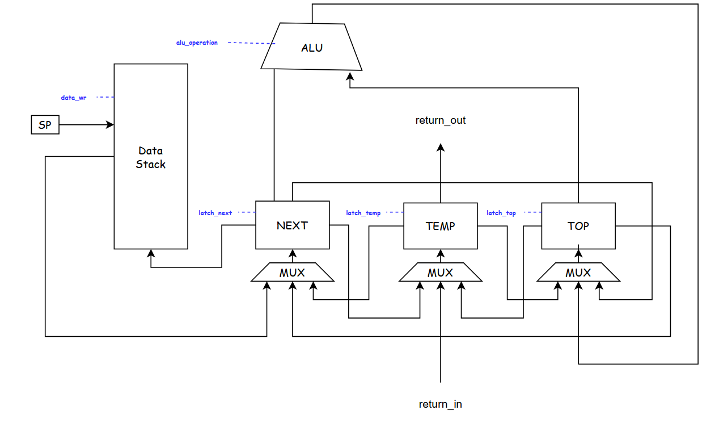
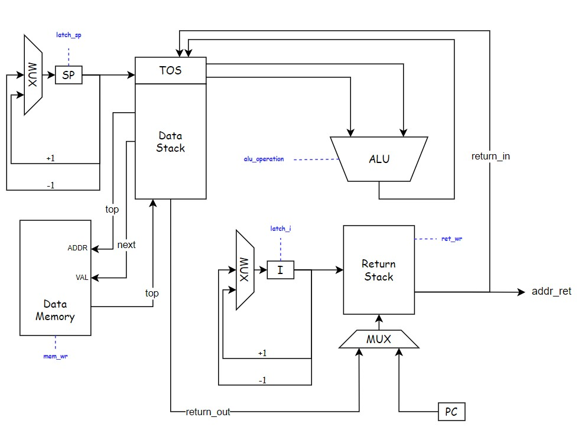
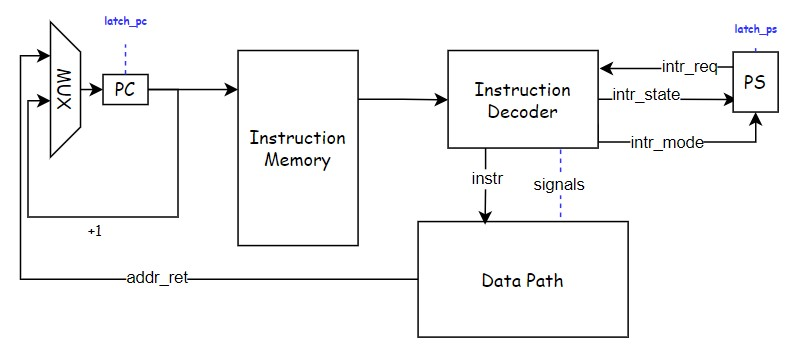
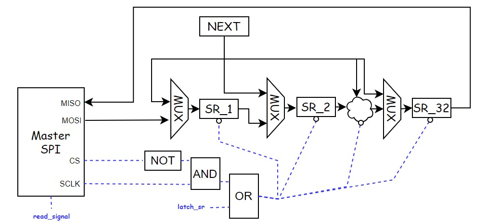

# Лабораторная работа №3. Транслятор и модель процессора

* P33121. Зинатулин Артём Витальевич
* ```forth | stack | harv | hw | tick | struct | trap | port | pstr | prob5 | spi```
* с усложнением

## Язык программирования

```ebnf

<процедура> →   ": " <название процедуры> <программа> " ;"

<программа> →   <пусто> | <слово> | <программа> " " <программа> | <условный оператор> |
                <оператор цикла do loop> | <оператор цикла begin until> <объявление переменной>
                
<объявление переменной> → "variable " <переменная> ["allot " <целочисленный литерал>] 

<условный оператор> → if <программа> [else <программаа>] then  

<оператор цикла do loop> → do <программа> loop  

<оператор цикла begin until> → begin <программа> until  

<слово> →   <целочисленный литерал> | <математический оператор> | <отображение строки> | <название процедуры> |
            "mod" | "drop" | "swap" | "over" | "dup" | "read" | "omit" | <переменная> | "@" | "!" | "ei" | "di"

<математический оператор> → "+" | "-" | "*" | "/" | "=" | "<" | ">" 

<отображение строки> → "." <строковый литерал>

```

Код выполняется последовательно за исключением процедур.
Вызов процедуры осуществляется при указании в программе её названия. Комментарии не предусмотрены.

Ниже описаны основные стековые операции в виде (stack_before -- stack_after) с некоторыми пояснениями.

* ```+``` - (n1 n2 -- n3)
* ```-``` - (n1 n2 -- n3)
* ```*``` - (n1 n2 -- n3)
* ```/``` - (n1 n2 -- n3)
* ```=``` - (n1 n2 -- n3) n3 = 1 if n1 == n2 n3 = 0 if n1 != n2
* ```>``` - (n1 n2 -- n3) n3 = 1 if n1 > n2 n3 = 0 if n1 <= n2
* ```<``` - (n1 n2 -- n3) n3 = 1 if n1 < n2 n3 = 0 if n1 >= n2
* ```mod``` - (n1 n2 -- n3)
* ```drop``` - (n1 -- )
* ```swap``` - (n1 n2 -- n2 n1)
* ```over``` - (n1 n2 -- n1 n2 n1)
* ```dup``` - (n1 -- n1 n1) -
* ```key``` - (n1 -- n2) - ввод c порта n1
* ```omit``` - (n1 n2 -- ) - вывести ASCII символ с кодом n1 в IO порт n2
* ```read``` - (n1 -- n2) - прочитать значение с порта n1 и положить на стек
* ```!``` - (n1 n2 -- ) - записать значение n1 в ячейку памяти n2
* ```@``` - (n1 -- n2) - прочитать значение из ячейки памяти n1 и положить его на стек
* ```ei``` - ( -- ) - включить прерывания
* ```di``` - ( -- ) - отключить прерывания

Условный оператор ```if``` выполняется в зависимости от истинности значения на вершине стека.
Истинным значением является любое целое числа за исключением 0. Ложным значением является 0.

Оператор цикла ```do loop``` выполняет ```K``` итераций в зависимости от двух значений на вершине стека (n1 n2);
```K = n1 - n2```. Внутри конструкции ```do loop``` возможно использовать
переменную ```i```, ```i = n2 + <номер итерации>```.
Аналогично конструкции ```for (i = n2; i < n1; i++) {}``` в алгоритмическом языке программирования

Оператор цикла ```begin until``` выполняет итерации до момента, когда на вершине стека
по достижению конструкции until не будет лежать истинное значение (отличное от нуля).

Оператор объявления переменной ```variable``` создаёт переменную и сопоставляет ей
определенную ячейку памяти, взаимодействовать с которой возможно при помощи ```!``` и ```@```.
В случае добавления ключевого слова ```allot``` выделяется непрерывный участок памяти с фиксированным
в программе размером.

Комментарии не предусмотрены.

Используемые литералы:

* строковые литералы - имеют вид " <строка>", используются для экранизации текста после оператора ```.```
* целочисленные литералы - являются полноценным словом в программе и необходимы для того, чтобы положить конкретное
  значение на вершину стека, диапазон значений - $[-2^{31}, 2^{31} - 1]$

## Организация памяти

* Память данных и команд раздельна
* Размер машинного слова данных -- 32 бита
* Размер машинного слова команд -- 40 бит, первые 8 бит -- тип команды (размер условен, кодирование в виде json)
* Программисту в явном виде доступен исключительно стек данных и память, зарезервированная
  под переменные
* Память данных и команд выделяется статически при запуске модели
* Доступен один вид прерываний - его обработчик лежит по адресу 01 в памяти команд
* Процедуры хранятся в памяти последовательно, и вызов может быть выполнен из любой
  части программы. Подробнее - см. трансляция.
* Машинная команда может использоваться как с аргументами (адрес/значение), так и без них.
* Ввиду специфики варианта, числовые и строковые литералы записываются в память данных в
  момент исполнения программы, а не при запуске модели с помощью команд с Immediate Value.
  Формирование команд для записи строковых литералов -- на этапе трансляции
* Все переменные хранятся статически в памяти данных
* Используется стек данных и стек возврата, они являются отдельным физическим устройством
  по отношению к памяти данных и команд (см. модель процессора)

Память команд

```text

+-----------------------------+
| 00       jmp N              |
| 01       interrupt handle   |
|      ...                    |
| N - 1    interrupt handle   |
+-----------------------------+
| N        program            |
| N + 1    program            |
|      ...                    |
| 15000    program            |
+-----------------------------+
```

Память данных

```text
+-----------------------------+
| 00       string literals    |  |
| 01       string literals    |  |
|      ...                    |  v
| 511      strings literal    |  
+-----------------------------+
| 512      variables          |  |
| 513      variables          |  |
|      ...                    |  v
| 15000    variables          |  
+-----------------------------+

```

Команда в памяти команд (условно, в варианте используется json-кодирование):

```text
+-----------------------------------------------------------+
| Код команды (0:7) | Адрес / Immediate Value (8:39)        |
+-----------------------------------------------------------+
```

## Система команд

### Цикл исполнения команды

1. Выборка инструкции (без сохранения информации в промежуточные регистры)
2. Исполнение команды (количество тактов необходимых для исполнения указано в таблице ниже)
3. Проверка на прерывание (если прерывание, сохранение PC в Return Stack, переход к обработчику прерывания)

### Набор инструкций

Большинство инструкций языка в явном виде соответствуют машинным командам, в таблице ниже
приведены все элементы системы команд ([isa.py](isa.py)). Те машинные команды, которые без комментария --
соответствуют слову из языка программирования. Спецификация количества тактов и последовательность
действий -- в разделе "Модель процессора".

| Инструкция | Комментарий                                                            |
|:-----------|:-----------------------------------------------------------------------|
| mul        |                                                                        |
| div        |                                                                        |
| sub        |                                                                        |
| add        |                                                                        |
| mod        |                                                                        |
| eq         |                                                                        |
| gr         |                                                                        |
| ls         |                                                                        |
| drop       |                                                                        |
| swap       |                                                                        |
| over       |                                                                        |
| dup        |                                                                        |
| ei         | разрешить прерывания                                                   |
| di         | запретить прерывания                                                   |
| omit       |                                                                        |
| read       |                                                                        |
| store      | память данных из стека                                                 |
| load       | в стек из памяти данных                                                |
| push imm   | записать в стек непосредственное значение                              |
| pop        | перенести значение со стека данных в стек возврата                     |
| rpop       | перенести значение из стека возврата в стек данных                     |
| jmp addr   | перейти по адресу                                                      |
| zjmp addr  | перейти по адресу, если на вершине стека 0 (убирает значение со стека) |
| call addr  | вызов процедуры                                                        |
| ret        | выход из процедуры или прерывания                                      |
| halt       | завершение программы                                                   |

### Кодирование инструкций

Инструкции кодируются в формат JSON и имеют вид:

```json
 {
  "index": 165,
  "command": "push",
  "arg": 554
}
```

В данной конструкции аргумент опционален и может быть упущен в зависимости от типа команды.

## Транслятор

Интерфейс командной строки `translator.py <input_file> <target_file>`

Реализован в модуле [translator.py](translator.py).

Основные сущностные элементы используемые в процессе трансляции:

* слово -- исходное слово в тексте программы (разделены пробелами)
* терм (Term ([translator.py:Term](translator.py#L9))) -- слово программы, преобразованное в формат машинной команды (
  слово != терм только для литералов)
* машинное слово (Opcode ([isa.py:Opcode](isa.py#L57))) -- непосредственно машинная команда

Трансляция происходит в несколько этапов ([translator.py:translate](translator.py#L357)):

1. Разбиение исходного текста программы в набор термов (1 слово = 1 терм)
2. Валидация полученных термов (циклы, процедуры, условные операторы)
3. Трансляция термов в машинные команды (1 терм = N команд)
4. Линковка

### Разбиение текста программы в набор термов

Так как текст программы представляет собой набор слов, разделенных пробелами
или переносом строки, процесс перевода слов в набор термов тривиален.

Реализуется функцией [translator.py:split_to_terms](translator.py#L61).

### Валидация полученных термов

Корректная программа на языке Forth должна удовлетворять формальным условиям, описанных в разделе "Язык
программирования".
Менее формально:

* терму `DO` должен соответствовать последующий терм `LOOP`
* терму `BEGIN` должен соответствовать последующий терм `UNTIL`
* терму `IF` должен соответствовать последующий терм `THEN`, между ними может располагаться терм `ELSE`
* терму `:` должен соответствовать последующий терм `;`
* терму `:intr` должен соответствовать последующий терм `;`
* объявление переменной должно иметь вид `variable <name> [allot <int>]`

Таким образом, на данном этапе проводится валидация термов, их дополнение необходимой мета-информацией
и оповещение пользователя в случае неуспешной трансляции с указанием ошибки и номера слова с ошибкой.

Реализуется функцией [translator.py:validate_and_fix_terms](translator.py#L174).

### Трансляция термов в машинные команды

Одному терму может соответствовать несколько Opcode, следовательно, необходимо корректным образом
с эффективностью по времени преобразовать термы в последовательность машинных команд.
В терминах языка Python применяются следующие трансформации:

```text
  list[Term] -> list[list[Opcode]] -> list[Opcode]
```

Первые два списка имеют одинаковую длину, во втором преобразовании происходит "распрямление"
полученного списка списков машинных команд.

Правила трансляции Term в Opcode с комментарием преобразований на стеке
определены в функции [translator.py:term_to_opcodes](translator.py#L227).

### Линковка

На этапе валидации каждому терму `IF`, `DO`, `:`, `ELSE` ставится в соответствие дополняющий его терм.
Подобная процедура выполняется также для `variable`, `allot`.

Таким образом, получается список операций, некоторые из которых могут ссылаться на другие.

Для преобразования этой структуры в последовательный список термов необходимо провести их
линковку, т.е. заменить адреса на термы адресами на машинные команды. Для этого используются различные
варианты адресации внутри машинных команд (абсолютная -- на конкретный терм и относительная -- по отношению к текущему
терму).
Реализуется функцией [translator.py:fix_addresses_in_opcodes](translator.py#L306).

Стоит заострить внимание на процессе трансляции строковых литералов и операторов DO, LOOP, i.
Данные инструкции трансформируются в несколько команд и некоторые из них затрагивают стек возврата.
Перед выполнением данных команд выставляется флаг на запрет прерываний, после выполнения -- снимается.

Остановимся подробнее на строковых литералах.
Так как целочисленные литералы преобразуются в машинную команду `PUSH <int>`, было
решено применить ради простоты модели процессора подобный механизм и для строк.
Строковые литералы в языке Forth используются сразу для вывода их на внешние устройства,
следовательно, строковый литерал вида `." string"` будет развернут в последовательность команд,
выполняющие следующие действия:

* запись в память данных размера строки (prefix-strings)
* посимвольная запись содержимого строки в память данных
* цикл, который осуществляет вывод строки

Данная последовательность команд может быть сокращена просто до вывода строки на внешнее
устройство, но имеет такой вид ввиду формальных критериев к лабораторной работе относительно
хранения строк в памяти.

## Модель процессора

Интерфейс командной строки: `machine.py <machine_code_file> <input_file>`

Реализовано в модуле: [machine.py](machine.py).

Stack Controller:


DataPath:


ControlUnit:


DataPath реализован в классе [machine.py:DataPath](machine.py#L118).

ControlUnit реализован в классе [machine.py:ControlUnit](machine.py#L233). .

Stack Controller является частью DataPath и предназначен для упрощения схемы, в коде включен в
класс [machine.py:DataPath](machine.py#L118).

Память:

* `Data Memory` -- однопортовая память данных
* `Instruction Memory` -- однопортовая память команд (Read Only)
* `Data Stack` -- стек для хранения данных программы (доступен программисту)
* `Return Stack` -- стек для хранения адресов возврата и переменной цикла

В модели процессора предусмотрены следующие регистры (недоступны для программиста):

* `SP` -- адрес верхушки стека данных минус два верхних элемента
* `I` -- адрес верхушки стека возврата
* `PC` -- адрес указывающий на текущую исполняемую команду
* `PS` -- состояние программы, 3 бита: разрешены ли прерывания и есть ли запрос на прерывания, находится ли в прерывании
* `TOP` -- значение на верхушке стека
* `NEXT` -- значение второго элемента сверху на стеке
* `TEMP` -- предназначен для эффективного выполнения операций на стеке

В рамках текущей реализации процессора приведем более подробную таблицу с описанием реализуемой системы команд.

| Инструкция                          | Действия процессора                                                   | Количество тактов |
|:------------------------------------|:----------------------------------------------------------------------|-------------------|
| mul, div, sub, add, mod, eq, gr, ls | TOP = TOP x NEXT; SP -= 1; NEXT = MEM                                 | 3                 |
| drop                                | TOP = NEXT; SP -= 1; NEXT = MEM                                       | 2                 |
| swap                                | TEMP = TOP; TOP = NEXT; NEXT = TEMP                                   | 3                 |
| over                                | MEM = NEXT; TEMP = TOP; SP += 1; TOP = NEXT; NEXT = TEMP              | 4                 |
| dup                                 | MEM = NEXT; NEXT = TOP; SP += 1                                       | 2                 |
| store                               | DATA_MEM = NEXT; SP -= 1; NEXT = MEM; TOP = NEXT; SP -= 1; NEXT = MEM | 4                 |
| load                                | TOP = DATA_MEM                                                        | 1                 |
| push                                | MEM = NEXT; SP += 1; NEXT = TOP; TOP = IMMEDIATE                      | 3                 |
| pop                                 | TEMP = TOP; TOP = NEXT; SP -= 1; NEXT = MEM; RET_STACK = TEMP; I += 1 | 4                 |
| rpop                                | I -= 1; TEMP = RET_STACK; MEM = NEXT; NEXT = TOP; SP += 1; TOP = TEMP | 4                 |
| jmp                                 | PC = IMMEDIATE                                                        | 1                 |
| zjmp                                | PC = IMMEDIATE; TOP = NEXT; SP -= 1; NEXT = MEM                       | 2                 |
| call                                | RETURN_STACK = PC; I += 1; PC = IMMEDIATE                             | 2                 |
| ret                                 | I -= 1; PC = RET_STACK                                                | 2                 |

Действия процессора в данной таблице в явном виде описывают последовательность сигналов, которые
выставляет дешифратор команд. В таблице не отражен тот факт, что команды могут исполняться за меньшее
количество тактов, нежели необходимо действий процессора, т.к. некоторые последовательные действия независимы
и могут быть выполнены за один такт.

Подробную реализацию дешифрации команд можно найти в
методе [ControlUnit:decode_and_execute_instruction](machine.py#L436).

## Особенности варианта

### SPI



Вся логика работы SPI отображена в классе [MasterSPI](machine.py#L488).
Часть схемы, которая отображена на рисунке, относится к DataPath, в реализации содержит
три 32-битных регистра: SR, SR_Input, SR_Output ([DataPath:__init__](machine.py#L119)).
Последние два предназначены для фиксации значения на ввод и вывод соответственно через SPI.

Регистр SR является сдвиговым регистром и предназначен для передачи значения обратно в MasterSPI.
Ввод-вывод через SPI осуществляется побитово и управляется сигналами CS и SCLK. В рамках модели
сигнал SCLK синхронизирован с тактовым генератором процессора ввиду особенностей golden тестирования.

Ввод-вывод данных реализован в обе стороны с полноценным моделированием сдвигов значения, как
на MasterSPI, так и на SlaveSPI (в классе [MasterSPI](machine.py#L488) также присутствует сдвиговый регистр).

Защёлкивание значений в сдвиговых регистрах (в MasterSPI и SlaveSPI)
выполняется по спаду сигнала `(!CS & SCLK) | LATCH_SR`. В зависимости от сигналов
на мультиплексорах выполняется либо сдвиг значения регистра (как на MasterSPI, так и на SlaveSPI), либо
перезапись регистра SR значением из регистра NEXT (предпоследний элемент стека -- на момент защёлкивания
регистра, именно в NEXT хранится результат вывода).

Физически на фронте сигнала ничего не происходит, но в рамках модели там устанавливается необходимое
значение сигналов MOSI и MISO.

Таким образом, при необходимости вывода данных на внешние устройства:

1) в сдвиговый регистр SRO защёлкивается значение регистра NEXT
2) отправляется сигнал signal_read на MasterSPI, который указывает на необходимость переключения CS
3) когда пришёл сигнал от MasterSPI, защёлкивается значение регистра SR из регистра SRO
4) начинается последовательный сдвиг регистров до полной перезаписи регистров
   (управлением этим процессом занимается MasterSPI, не отображено на схеме)
5) сигнал CS устанавливается в 1, передача данных закончена

Данный процесс внешний по отношению к процессору, и в это время процессор исполняет остальные инструкции, но
в случае, если сигнал CS установлен в 0, и встретилась инструкция вывода, процессор будет ожидать, пока
вывод не будет закончен.

### Прерывания

Ввод данных реализован с использованием механизма прерываний и вышеописанного SPI. По отношению
к ControlUnit и DataPath процесс отслеживания прерываний является внешним -- им управляет MasterSPI.
Отслеживание прерываний в рамках модели реализовано в методе [MasterSPI:check_for_input](machine.py#L527).
Когда прерывание было обнаружено, SPI начинает сеанс передачи данных, если CS установлен в 1 (не осуществляется
передача).

После того как данные были переданы через SPI и записаны в регистр SRI, защёлкивается положительное
значение в флаге Intr_Req (регистр PS). При обнаружении данного сигнала в регистре PS (проверка на каждом цикле
исполнения команды),
выполняется переход к обработчику прерываний, устанавливается флаг Intr_Mode.

Инструкция ret вне зависимости от того, был ли действительно процессор в режиме обработки прерывания,
сбросит этот флаг.

По причине использования SPI и передаче данных за несколько десятков тактов, журнал работы процессора достаточно
объёмен. Возникновение прерывания с запозданием на несколько десятков тактов обусловлено тем, что проверка
прерывания возникает в MasterSPI, а его обработка происходит в самом процессоре.

## Тестирование

В качестве тестов использовано четыре алгоритма:

1. [alice](examples/forth/alice.fth)
2. [cat](examples/forth/cat.fth)
3. [hello-world](examples/forth/hello.fth)
4. [prob5](examples/forth/prob5.fth)

Интеграционные тесты реализованы в модуле [integration_test](./integration_test.py) в виде golden тестов:

CI при помощи Github Action:

``` yaml
name: Translator Model Python CI

on:
  push:
    branches:
      - master
    paths:
      - ".github/workflows/*"
      - "Translator-Model/**"
  pull_request:
    branches:
      - master
    paths:
      - ".github/workflows/*"
      - "Translator-Model/**"

defaults:
  run:
    working-directory: ./Translator-Model

jobs:
  test:
    runs-on: ubuntu-latest
    steps:
      - name: Checkout code
        uses: actions/checkout@v4
      - name: Set up Python
        uses: actions/setup-python@v4
        with:
          python-version: 3.11
      - name: Install dependencies
        run: |
          python -m pip install --upgrade pip
          pip install poetry
          poetry install
      - name: Run tests and collect coverage
        run: |
          poetry run coverage run -m pytest .
          poetry run coverage report -m
        env:
          CI: true

  lint:
    runs-on: ubuntu-latest
    steps:
      - name: Checkout code
        uses: actions/checkout@v4
      - name: Set up Python
        uses: actions/setup-python@v4
        with:
          python-version: 3.11
      - name: Install dependencies
        run: |
          python -m pip install --upgrade pip
          pip install poetry
          poetry install
      - name: Check code formatting with Ruff
        run: poetry run ruff format --check .
      - name: Run Ruff linters
        run: poetry run ruff check .
```

где:

* `poetry` -- управления зависимостями для языка программирования Python.
* `coverage` -- формирование отчёта об уровне покрытия исходного кода.
* `pytest` -- утилита для запуска тестов.
* `ruff` -- утилита для форматирования и проверки стиля кодирования.

Пример проверки исходного кода:

``` text
collected 4 items

integration_test.py::test_translator_and_machine[golden/alice.yml] PASSED                                                                                                                                                                                    [ 25%]
integration_test.py::test_translator_and_machine[golden/cat.yml] PASSED                                                                                                                                                                                      [ 50%]
integration_test.py::test_translator_and_machine[golden/hello.yml] PASSED                                                                                                                                                                                    [ 75%]
integration_test.py::test_translator_and_machine[golden/prob5.yml] PASSED                                                                                                                                                                                    [100%]

======================================================================================================================== 4 passed in 1.73s ======================================================================================================================== 
```

```text
collected 4 items

integration_test.py ....                                                 [100%]

============================== 4 passed in 7.88s ===============================
Name                  Stmts   Miss  Cover   Missing
---------------------------------------------------
integration_test.py      28      0   100%
isa.py                   58      2    97%   20, 54
machine.py              347     15    96%   43, 88, 90, 92, 94, 108, 180-181, 189, 608-614
translator.py           228      5    98%   135-136, 389-391
---------------------------------------------------
TOTAL                   661     22    97%
```

```text
| ФИО                            | алг     | LoC | code байт | code инстр. | инстр. | такт. | вариант                                                                         |
| Зинатулин Артём Витальевич     | alice   | 20   | -        | 218         | 1471   | 3250  | forth | stack | harv | hw | tick | struct | trap | port | pstr | prob5 | spi    |
| Зинатулин Артём Витальевич     | cat     | 8    | -        | 21          | 377    | 713   | forth | stack | harv | hw | tick | struct | trap | port | pstr | prob5 | spi    |
| Зинатулин Артём Витальевич     | hello   | 1    | -        | 58          | 392    | 789   | forth | stack | harv | hw | tick | struct | trap | port | pstr | prob5 | spi    |
| Зинатулин Артём Витальевич     | prob5   | 24   | -        | 126         | 1819   | 5130  | forth | stack | harv | hw | tick | struct | trap | port | pstr | prob5 | spi    |
```
